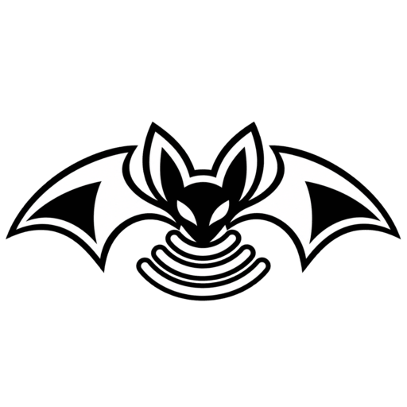

<p align="center">
  
</p>

<h1 align="center">Packet Bat</h1>

<p align="center">
  <strong>
    A pocket-sized wireless protocol research platform powered by ESP32-S3.
  </strong>
</p>

<p align="center">
  <em>Listen to the air. Understand the protocol.</em>
</p>

---

# Overview

**Packet Bat** is an open-source educational platform for exploring
wireless communication at a low level.

Built around the **ESP32-S3-WROOM-1**, it combines custom firmware with a modern web interface to inspect, capture, and experiment with **Wi-Fi**, **Bluetooth Low Energy**, and eventually other **RF protocols**.

The name comes from the way bats explore their environment using signals.

Packet Bat follows a similar idea — **listen to the air, capture what is happening, and understand the protocols behind it.**

---

## Why Packet Bat?

Modern wireless technologies hide enormous complexity behind simple APIs.

Packet Bat is built to go beneath those abstractions.

Instead of only using Wi-Fi or Bluetooth libraries at a high level, the project explores how wireless communication actually works:

- how devices discover each other;
- how frames are structured;
- how clients and access points communicate;
- how authentication and handshakes work;
- how packets can be captured and inspected;
- how wireless protocols behave at the lowest accessible layers;
- and how this knowledge applies to cybersecurity.

The core philosophy of the project is simple:

> **To understand how wireless protocols can be secured, you must first understand how they actually work.**

Packet Bat is primarily a learning and research project focused on **protocol internals, embedded development, network analysis, and defensive cybersecurity**.

---

## Features

Packet Bat combines multiple wireless research tools inside a single ESP32-S3 platform.

### 📶 Wi-Fi

Explore IEEE 802.11 communication and nearby wireless activity.

Current research includes:

- Wi-Fi network discovery
- Client discovery
- Raw 802.11 frame inspection
- Promiscuous packet capture
- Channel-based monitoring
- Authentication and handshake research
- EAPOL frame analysis
- PCAP capture and export
- Controlled wireless security experiments

### 📡 Bluetooth Low Energy

Explore BLE devices and communication.

Current work includes:

- BLE device discovery
- Advertisement inspection
- Raw BLE event processing
- Device information analysis
- Low-level Bluetooth experimentation

### 📻 RF

Packet Bat is designed so additional radio hardware and protocols can be explored in the future.

The goal is to eventually extend the same workflow beyond Wi-Fi and Bluetooth:

**discover → capture → inspect → understand**

---

## Web Interface

Packet Bat includes its own web application built with **React**.

The interface is served directly by the ESP32 using **LittleFS**, so no external application or server is required during normal use.

Open Packet Bat in a browser to access the device.

The frontend provides:

- wireless scanning;
- network and client selection;
- real-time device status;
- packet and handshake information;
- capture controls;
- downloadable research data;
- Wi-Fi and Bluetooth tools.

The UI is designed around a clean **shadcn/ui** style and acts as the control surface for the embedded device.

---

## Real-Time Communication

The frontend communicates directly with the ESP32 through:

- **HTTP REST API**
- **Server-Sent Events (SSE)**

HTTP is used for commands and state requests, while SSE provides real-time events from the firmware.

```text
Browser
   │
   ├──── HTTP ────────► Commands / State
   │
   └──── SSE ◄──────── Events / Discoveries
                         │
                         ▼
                     Packet Bat
```

This allows the interface to receive wireless discoveries and device-state changes without continuously polling the ESP32.

---

## Project Structure

```text
.
├── firmware/               # ESP32-S3 PlatformIO firmware
│
├── frontend/               # React web interface
│
├── bin/
│   └── build.sh            # Frontend + LittleFS build script
│
└── README.md
```

### Firmware

Contains the ESP32-S3 application responsible for:

- Wi-Fi
- Bluetooth
- packet processing
- protocol research
- HTTP API
- Server-Sent Events
- device state
- LittleFS web hosting

### Frontend

Contains the Packet Bat web interface.

Built using React, TypeScript, Tailwind CSS, and shadcn/ui.

---

## Technology Stack

### Firmware

- **ESP32-S3-WROOM-1**
- **PlatformIO**
- **Arduino Framework**
- **LittleFS**
- **ESPAsyncWebServer**
- **AsyncTCP**
- **ArduinoJson**
- **NimBLE-Arduino**
- **Adafruit NeoPixel**

### Frontend

- **React 19**
- **TypeScript**
- **Vite**
- **Tailwind CSS**
- **shadcn/ui**
- **Zustand**
- **React Router**
- **Radix UI**
- **Sonner**

---

# Getting Started

## Requirements

### Hardware

- ESP32-S3-WROOM-1

### Software

Install the following tools before building Packet Bat:

- Git
- Node.js
- npm
- PlatformIO

---

## Clone

Clone the repository:

```bash
git clone https://github.com/your-name/packet-bat.git
cd packet-bat
```

---

## Frontend Development

Navigate to the frontend:

```bash
cd frontend
```

Install dependencies:

```bash
npm install
```

Start the Vite development server:

```bash
npm run dev
```

Create a production build:

```bash
npm run build
```

---

## Firmware

Open the `firmware` directory as a PlatformIO project.

The project is configured for the ESP32-S3.

### PlatformIO Configuration

```ini
[env:esp32-s3-devkitm-1]

platform = espressif32
board = esp32-s3-devkitm-1
framework = arduino

monitor_speed = 115200

board_build.filesystem = littlefs
board_build.partitions = default_8MB.csv

lib_deps =
    h2zero/NimBLE-Arduino
    bblanchon/ArduinoJson
    ESP32Async/ESPAsyncWebServer
    ESP32Async/AsyncTCP
    adafruit/Adafruit NeoPixel

build_flags =
    -D ARDUINO_USB_CDC_ON_BOOT=1
    -D ARDUINO_USB_MODE=1
    -Wl,--wrap=esp_wifi_80211_tx
    -Wl,-z,muldefs
```

PlatformIO will automatically install the required libraries.

---

## Build Packet Bat

The React frontend must be compiled and prepared for LittleFS before flashing the complete application.

From the project root run:

```bash
./bin/build.sh
```

The script:

1. Builds the React application.
2. Prepares the LittleFS filesystem.
3. Copies the generated frontend files into the firmware data directory.

After this step, the ESP32 can serve the Packet Bat interface directly from its flash storage.

---

## Flash the Device

Navigate to the firmware directory:

```bash
cd firmware
```

Build the firmware:

```bash
pio run
```

Upload it:

```bash
pio run --target upload
```

Upload the LittleFS filesystem:

```bash
pio run --target uploadfs
```

Open the serial monitor:

```bash
pio device monitor
```

Packet Bat is now ready to start.

---

# Research Goals

Packet Bat is not intended to hide wireless communication behind abstractions.

It is built specifically to expose them.

The project explores topics such as:

- IEEE 802.11
- Bluetooth Low Energy
- RF communication
- MAC addressing
- management, control, and data frames
- authentication
- EAPOL
- wireless handshakes
- packet capture
- PCAP
- promiscuous monitoring
- network protocols
- embedded networking
- ESP32 radio APIs
- firmware architecture
- wireless security
- defensive cybersecurity
- ethical security research

The goal is not simply to create another wireless tool.

The goal is to understand **why the tool works**.

---

# Educational Philosophy

Packet Bat is built around learning by implementation.

Instead of treating protocols as black boxes, the project attempts to inspect their structures, reproduce parts of their behavior, and observe how real devices communicate.

This provides practical experience across several layers:

```text
Radio
  ↓
Frames
  ↓
Packets
  ↓
Protocols
  ↓
Device behavior
  ↓
Security
```

Understanding each layer makes it easier to understand both the strengths and weaknesses of wireless systems.

That knowledge can then be applied to protocol analysis, security research, vulnerability understanding, and defensive engineering.

---

# Responsible Use

> **Packet Bat is intended strictly for education, research, protocol analysis, and authorized cybersecurity testing.**

Wireless security research can involve functionality capable of interfering with or analyzing nearby devices and networks.

Only use Packet Bat with:

- your own devices and networks;
- isolated laboratory environments;
- systems for which you have explicit authorization.

Do not use Packet Bat to access, disrupt, monitor, or attack systems without permission.

The project exists to help developers and security researchers understand wireless technology and learn how vulnerabilities and defensive mechanisms work at a low level.

Users are responsible for ensuring their use of Packet Bat complies with applicable laws and regulations.

---

# License

Packet Bat is released under the **MIT License**.

See [`LICENSE`](LICENSE) for details.

---

<p align="center">
  
  <br />
  <sub>Listen to the air. Understand the protocol.</sub>
</p>